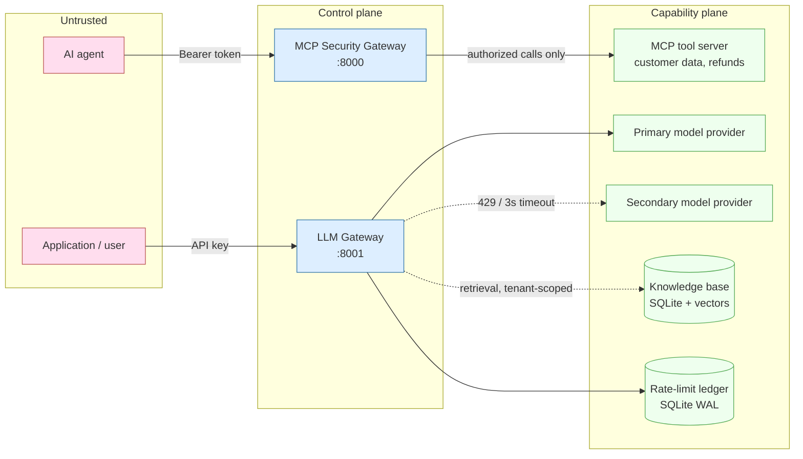
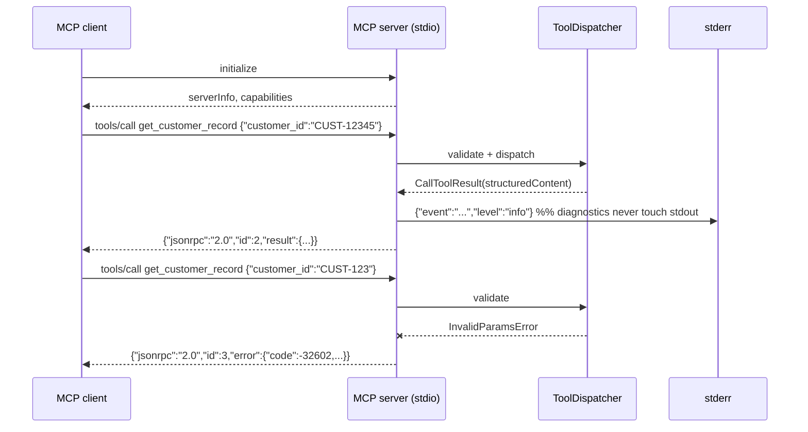
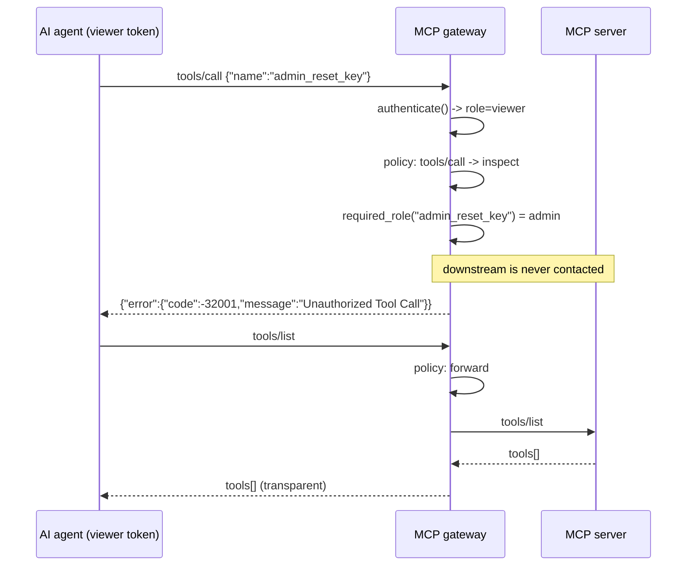
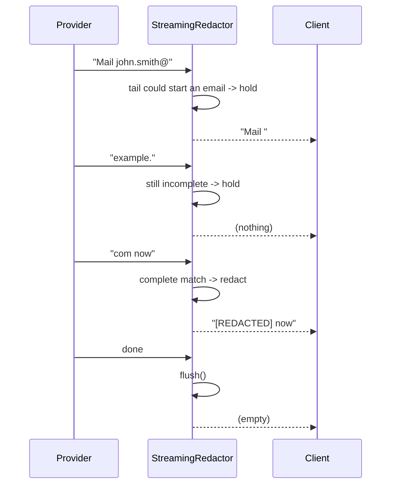
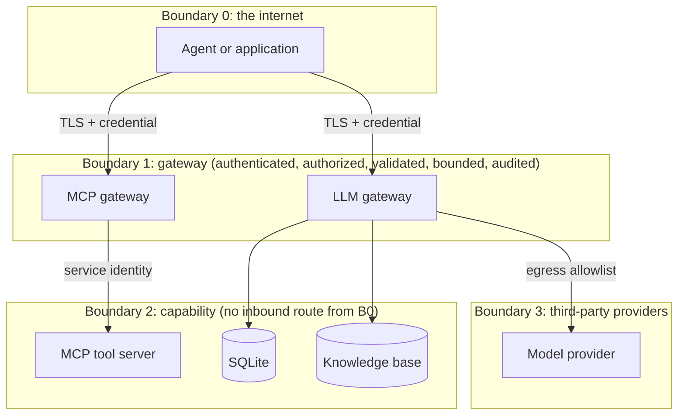

# Architecture

Two independent gateways in front of two different kinds of dangerous
capability: an MCP server that can *act*, and a model that can *disclose*.
They share a configuration model, an error vocabulary, a logging policy and a
metrics registry, and nothing else, a failure in one cannot take the other
down.

---

## 1. System view



The capability plane is not routable from the untrusted plane. In
`docker-compose.yml` this is enforced with an `internal: true` network: the
mock MCP server has no route off it, so the gateway is the only path in.

---

## 2. Components

| Component | Module | Responsibility |
|---|---|---|
| MCP server | `mcp_server/server.py` | Task 1. Official SDK over stdio; strict validation; JSON-RPC error mapping |
| Tool registry | `mcp_server/registry.py` | Transport-independent dispatch; separates protocol errors from domain outcomes |
| MCP gateway | `mcp_gateway/app.py` | Task 2. Authentication, method policy, tool authorization, bounded proxying, audit |
| LLM gateway | `llm_gateway/app.py` | Tasks 3 + 4. Tenant auth, rate limit, routing, streaming, guardrail |
| Streaming guardrail | `llm_gateway/guardrails/` | Task 3. Bounded-carry PII redaction over chunked streams |
| Rate limiter | `llm_gateway/rate_limit/` | Task 4. Sliding-window token budget in one atomic transaction |
| Model router | `llm_gateway/routing/` | Task 4. First-token deadline, retryable-only failover, cancellation |
| RAG service | `rag/` | Production Enhancement. Tenant-scoped retrieval and prompt assembly |

Each module's source begins with WHAT / WHY / HOW / WHEN (and SECURITY / COST /
SCALE where relevant), so the rationale for a line of code is in the file that
contains it.

---

## 3. Task 1, MCP server and STDIO isolation



**Why stdout purity matters.** The transport is newline-delimited JSON on
stdout. A single stray `print` puts a non-JSON line into the frame stream: the
client either fails to parse it or silently loses the response it was waiting
for, and the session appears to hang intermittently. Three controls, because
one is not enough for a failure that is this quiet:

1. `common/logging.py` binds structlog and the stdlib root logger to stderr.
2. ruff's `T20` rule fails the build on any `print` under `src/`.
3. `tests/integration/test_stdio_isolation.py` runs the real server as a
   subprocess at `LOG_LEVEL=DEBUG`, parses every stdout line as JSON-RPC, and
   includes a negative control proving the test would catch a leak.

**Error classification.** Validation and protocol failures become JSON-RPC
errors (`-32602`, `-32601`). Domain outcomes, "no such customer", "account
suspended", become successful tool results with `isError: true`. Reporting a
domain refusal as a protocol error would tell the client the call never
happened.

---

## 4. Task 2, MCP gateway authorization



Three properties are load-bearing:

- **Identity comes from the header, never the body.** `authorize()` reads
  `principal.role`, which `authenticate()` derived from the bearer token.
  `params` is consulted only for the tool name. A viewer token whose payload
  claims `"role": "admin"` is still a viewer, asserted directly in
  `tests/security/test_mcp_gateway_auth.py`.
- **Fail closed on ambiguity.** An unknown method, a missing `params.name`, or
  a `name` that is not a string are all denials, not pass-throughs.
- **Denial is provable, not just plausible.** The tests assert
  `downstream.call_count == 0`, so "we returned the right error" and "we did
  not perform the action" are separately verified.

### Status-code contract (ADR-011)

| Situation | HTTP | Body |
|---|---|---|
| Missing/invalid bearer token | 401 + `WWW-Authenticate` | JSON-RPC error |
| Body over the size limit | 413 | JSON-RPC error |
| Unparseable JSON / malformed envelope | 400 | JSON-RPC error |
| Unauthorized tool call | **200** | `-32001 Unauthorized Tool Call` |
| Method outside policy | 200 | `-32601` |
| Downstream timeout / failure | 200 | `-32004` / `-32005` |

A failure that stopped a valid JSON-RPC exchange from starting is an HTTP
failure. Everything after that is a JSON-RPC outcome: a client that is required
to parse the error object should not have to also interpret a 5xx, and many
HTTP clients discard the body on one. The LLM gateway does the opposite (429,
502, 504) because it is an OpenAI-shaped REST API whose clients are HTTP
clients. The divergence is deliberate and recorded.

---

## 5. Task 3, streaming PII guardrail



The design question is what to hold and for how long.

- Emit every chunk immediately → PII split across boundaries escapes.
- Buffer the whole response → correct, but TTFT becomes total generation time
  and memory grows with the answer.

The middle path: after redacting complete matches, ask whether the tail could
still *become* a match. `". The answer is "` cannot start an email, SSN or card,
so it is emitted immediately, ordinary prose is never delayed. `john.smith@`
can, so it is held. A hard cap (`PII_CARRY_BUFFER_CHARS`, default 128) bounds
memory at O(window) per stream regardless of response length.

Card numbers are normalised, length-checked (13-19 digits) and Luhn-validated
before redaction, so an order reference that happens to be sixteen digits
survives while a real card does not.

Measured cost (see [docs/testing/BENCHMARKS.md](docs/testing/BENCHMARKS.md)):
about 1.5 ms to process 4 KB of prose, and about 3.4 µs for a single chunk, below the noise floor of a network hop.

---

## 6. Task 4, rate limiting and fallback

```mermaid
sequenceDiagram
    participant C as Client
    participant L as Rate limiter (SQLite)
    participant R as Model router
    participant P as Primary
    participant S as Secondary

    C->>L: estimate = prompt + max_output
    L->>L: BEGIN IMMEDIATE
    L->>L: evict rows older than the window
    L->>L: SUM(tokens) for this key
    alt used + estimate > limit
        L-->>C: 429 + Retry-After
    else fits
        L->>L: INSERT admission row; COMMIT
        R->>P: stream()
        alt first token within 3000 ms
            P-->>C: tokens (through the guardrail)
        else 429 or deadline exceeded
            R->>P: cancel + aclose()
            R->>S: stream()
            S-->>C: tokens (through the guardrail)
        end
        C->>L: reconcile(actual - estimate)
    end
```

**Why the check and the insert are one transaction.** Read the window sum,
decide, then insert, and two concurrent requests both read 49,000, both decide
they fit, and both insert. `BEGIN IMMEDIATE` plus an `asyncio.Lock` makes the
sequence atomic; `tests/concurrency/` fires 100 concurrent requests at a 50,000
budget and asserts exactly 50 are admitted, including across two connections to
the same file.

**Why the deadline covers time-to-first-token.** A whole-stream deadline would
truncate legitimate long answers. Once the first token has been forwarded,
failover is no longer transparent, bytes are on the wire, so the router stops
failing over and surfaces a clean error instead.

**Why failover is restricted.** Only 429, timeout, unavailable and malformed
upstream responses fail over. Retrying an invalid request or an auth failure
burns the secondary's quota, doubles the cost of a bad request, and turns a
deterministic 4xx into a slow 4xx.

---

## 7. Retrieval (Production Enhancement)

```mermaid
flowchart TD
    Q[User query] --> AU[Authenticate tenant]
    AU --> V[Validate + cap top_k]
    V --> E[Embed query]
    E --> ST[(Vector store)]
    ST -->|WHERE tenant_id = ? AND metadata| H[Ranked hits]
    H --> B[Score floor + de-dup + context budget]
    B --> PR[Prompt: system | untrusted context | user]
    PR --> LLM[LLM gateway]
    LLM --> GD[Streaming guardrail]
    GD --> R[Answer + citations]
```

Tenant isolation is a SQL predicate inside the store query, not an instruction
to the model. Another tenant's rows are never loaded into the process, so they
cannot be ranked, logged, or truncated into a prompt by a later bug.

Retrieved passages are placed in a labelled `<retrieved_context>` region that
the system prompt describes as untrusted data, and delimiter lookalikes are
neutralised so a document cannot close the block and start issuing
instructions. That is a mitigation, not a solution: the actual control is that
an injected instruction still cannot call a tool the caller could not call,
because the MCP gateway decides that on the caller's role.

---

## 8. Zero-trust boundaries



Every request crossing Boundary 1 is:

| Property | Mechanism |
|---|---|
| authenticated | `mcp_gateway/auth.py`, `llm_gateway/auth.py`, constant-time, full-table comparison |
| authorized | `mcp_gateway/policy.py` + `authorization.py`; retrieval filters for data |
| validated | Pydantic models with `extra="forbid"` at every entry point |
| bounded | body size, prompt length, `max_tokens`, `top_k`, context chars, token budget |
| audited | one structured event per decision, including whether the downstream was invoked |

Nothing is trusted because of where it came from: the mock downstream MCP
server has no authentication of its own, and the architecture states plainly
that this is why it must not be routable from the agent network.

---

## 9. Production evolution

| Concern | Today | Next | Why not now |
|---|---|---|---|
| Identity | configuration-driven token table | OIDC/JWT against the customer's IdP | The customer's IdP is not knowable in advance; the seam is one function |
| Rate limiting | SQLite, per node | Redis sorted sets, cluster-wide | One node needs no coordination; two do (ADR-006) |
| Durable state | SQLite WAL | PostgreSQL | Single-writer is sufficient at this scale (ADR-004) |
| Vector search | brute-force cosine in SQLite | pgvector or a managed vector DB | Linear over thousands of chunks beats operating a database (ADR-012) |
| Metrics | in-process registry + `/metrics` | `prometheus_client` or OTLP | Same call sites; only the registry changes |
| Guardrails | three regex families + Luhn | classifier or vendor DLP, plus customer patterns | Regex is the honest floor, not the ceiling |

Each row is an ADR in [docs/decisions/](docs/decisions/) with the trigger that
should cause the move.
