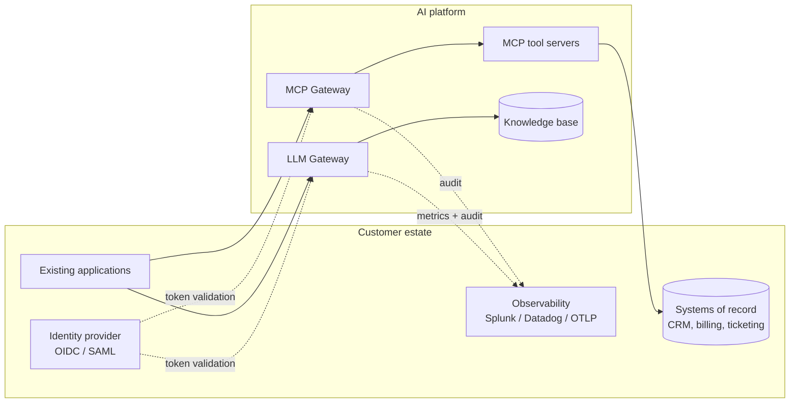
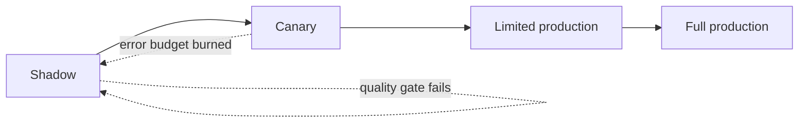
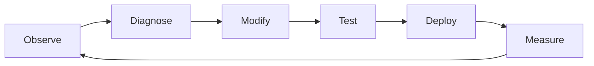

# FDE delivery model

How this architecture gets into a customer environment: what to ask, how to
integrate, how to roll out without betting the customer's traffic on it, and
what changes per vertical.

---

## 1. Discovery

The purpose of discovery is not to gather requirements, it is to find the
constraint that will kill the project if you learn it in week six.

### Use case and value

- What are people trying to do that they cannot do today?
- Which of those needs an LLM, and which needs a query, a report or a rule?
  (The most valuable early answer is often "this one does not need AI".)
- What does a wrong answer cost, a re-ask, a support ticket, or a regulatory
  filing?
- Who is accountable when the system is wrong?

### Data

- What data does the use case touch, and who owns each source?
- Which fields are sensitive, and under whose definition, PII, PHI, CUI,
  MNPI, trade secrets?
- May data leave the perimeter at all? Which providers are approved, under
  what contract? *This single answer determines the entire architecture.*
- What are the retention and deletion obligations?
- How often does the underlying data change?

### Identity and authorization

- What is the identity provider? OIDC, SAML, something bespoke?
- Do agents act as a service, or on behalf of a user? (If on behalf of a user,
  the tool authorization must carry the user's entitlements, not the service's.)
- What entitlement system decides who may see what today, and can the gateway
  query it?
- Which actions require a human in the loop regardless of confidence?

### Tools and blast radius

- Which systems should agents be able to read?
- Which should they be able to *write*, and what is the worst single call?
- What is the rollback path for each write?
- Who approves a new tool?

### Non-functionals

- Latency: what is acceptable for time-to-first-token, and what is the hard
  ceiling?
- Volume: requests per day, tokens per request, peak-to-average ratio?
- Availability target, and what "down" means to the business?
- Budget: monthly ceiling, and who is accountable when it is exceeded?

### Compliance and audit

- Which frameworks apply, SOC 2, HIPAA, PCI DSS, FedRAMP, GDPR, DORA?
- What must be auditable, retained for how long, and provable to whom?
- Is there an AI-specific review board or model-approval process?

**The questions that most often change the design:** may data leave the
perimeter, does the agent act as a user or as a service, and what is the worst
single tool call.

---

## 2. Integration

The four integration points, in the order they usually take:

1. **Identity**, replace the token table with the customer's IdP. One
   function; everything downstream consumes a `GatewayPrincipal`.
2. **Tools**, replace the in-memory repositories with adapters over the real
   systems of record. The tool contracts and validation do not change.
3. **Observability**, the metrics registry becomes `prometheus_client` or an
   OTLP exporter; audit events ship to the customer's SIEM. Call sites do not
   change.
4. **Providers**, implement `LLMProvider` for whichever vendor is approved.
   If none is, start with a local model and prove the pattern.

Deliberately *not* an integration point: the customer's data pipeline. Ingest a
narrow, well-understood corpus first. Broad ingestion early is how a pilot
becomes a data-governance review.

---

## 3. Rollout

| Phase | Traffic | What it proves | Exit criteria |
|---|---|---|---|
| **Shadow** | Mirrored, responses discarded | Latency, error rate, guardrail behaviour under real prompts | p95 within budget; no unexpected guardrail activations; zero cross-tenant retrieval |
| **Canary** | 1-5%, one team or tenant | Real users tolerate the answers | Quality above the agreed bar; no severity-1; cost per request within estimate |
| **Limited production** | 25-50%, named cohorts | Operations survive it | Runbooks exercised at least once; on-call trained; alerts fired and were actionable |
| **Full production** | 100% |, | Rollback tested and timed |

**Shadow mode is the phase teams skip and the one that pays.** It is the only
place to discover that real prompts contain PII the guardrail does not match,
or that p95 latency doubles on the customer's network, without a user seeing
it.

**Rollback is a first-class feature.** Route back to the prior behaviour with a
configuration change, not a redeploy. If rollback takes an hour, the effective
blast radius of any bad change is an hour of traffic.

---

## 4. Feedback loop

| Stage | What it means here |
|---|---|
| **Observe** | Metrics, audit events, and a channel where users report bad answers |
| **Diagnose** | Correlate by `request_id`: was it retrieval, the model, a guardrail, or a policy denial? |
| **Modify** | Change the smallest thing: a chunk size, a `top_k`, a policy entry, a prompt |
| **Test** | The evaluation set catches retrieval regressions; the security suite catches policy regressions |
| **Deploy** | Canary first, always |
| **Measure** | Did the metric that prompted the change actually move? |

Without an evaluation set, step 4 is opinion. That is why
`tests/rag/test_retrieval_quality.py` exists with measured, non-aspirational
thresholds, and why the first artefact to build with a customer is their own
version of it, drawn from questions their users actually ask.

---

## 5. Customer verticals

### Healthcare

**Constraint:** PHI cannot leave the perimeter without a BAA, and often not
even then.

- Local or in-VPC inference first; treat hosted providers as a later
  negotiation, not an assumption.
- The PII guardrail becomes a PHI guardrail: MRNs, NPIs, dates of birth,
  device identifiers. Regex is a floor; pair it with a clinical NER model.
- Minimum-necessary access maps directly onto tool-level authorization, scheduling tools for schedulers, clinical tools for clinicians.
- Every retrieval and every tool call must be attributable to a named user for
  audit.
- *No HIPAA compliance is claimed here.* These are architectural patterns that
  support such a programme.

### Financial services

**Constraint:** actions move money and are reviewed after the fact.

- Transaction-capable tools (`trigger_refund` is the toy version) need amount
  thresholds, approval workflows above a limit, and idempotency keys so a
  retry cannot double-pay.
- The audit event must answer "who, what, when, on whose authority, and was it
  authorized", the fields the gateway already emits.
- MNPI segregation is tenant isolation with a stricter blast radius: research
  and trading corpora must not be retrievable by the same principal.
- Model outputs that inform advice need provenance; citations are the
  mechanism.

### Federal and defence

**Constraint:** the network, not the application, is the primary control.

- Zero trust is the baseline expectation: mTLS between every hop, short-lived
  workload identity, no implicit trust from network position.
- Air-gapped or IL-classified environments mean local models and no egress, the provider abstraction is what makes that a configuration change.
- Deployment isolation per classification level; no shared state across
  boundaries.
- Extended audit retention and tamper-evident logs.
- *No FedRAMP or DoD authorization is claimed.*

### Enterprise SaaS

**Constraint:** many tenants, one deployment, per-tenant economics.

- Tenant isolation at the data layer (implemented) plus per-tenant quotas
  (implemented) plus per-tenant cost attribution (metrics are labelled).
- Quota tiers become a product surface: `RATE_LIMIT_TOKENS` per plan.
- Provider routing by tenant supports data-residency commitments.
- Cost per tenant must be visible before it is sold, not after.

---

## 6. What an FDE actually does here

The code in this repository is the artefact; the job is what surrounds it.

| Activity | Evidence in this repository |
|---|---|
| Enter an unfamiliar environment and orient | The brief was a PDF and an empty directory; the missing Task 5 was investigated and documented rather than invented |
| Translate business requirements into architecture | Each task's minimal reading and its real reading are contrasted in the README |
| Build a working prototype fast | Four tasks, 472 tests, all offline and deterministic |
| Secure an AI system | Threat model with residual risk, controls labelled implemented/partial/design |
| Explain trade-offs | 12 ADRs with alternatives and consequences, not just decisions |
| Optimize cost | $0 CI by construction; the production levers ranked by impact |
| Troubleshoot distributed systems | Failure-mode table and runbooks keyed to symptoms, not components |
| Deploy incrementally | Shadow → canary → limited → full, with exit criteria |
| Say what is not true | "Not claimed" sections in SECURITY.md and the limitations in the README |

The last row matters most. A customer will forgive a prototype's limits; they
will not forgive discovering a limit you knew about and did not mention.
