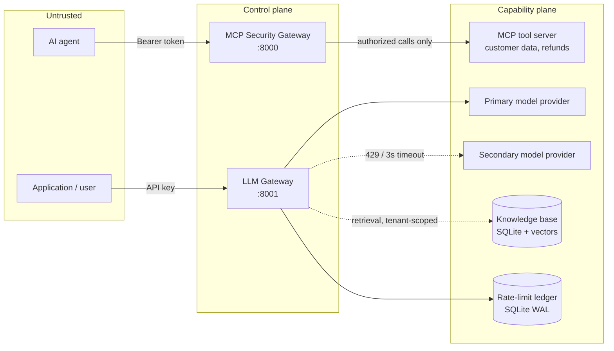
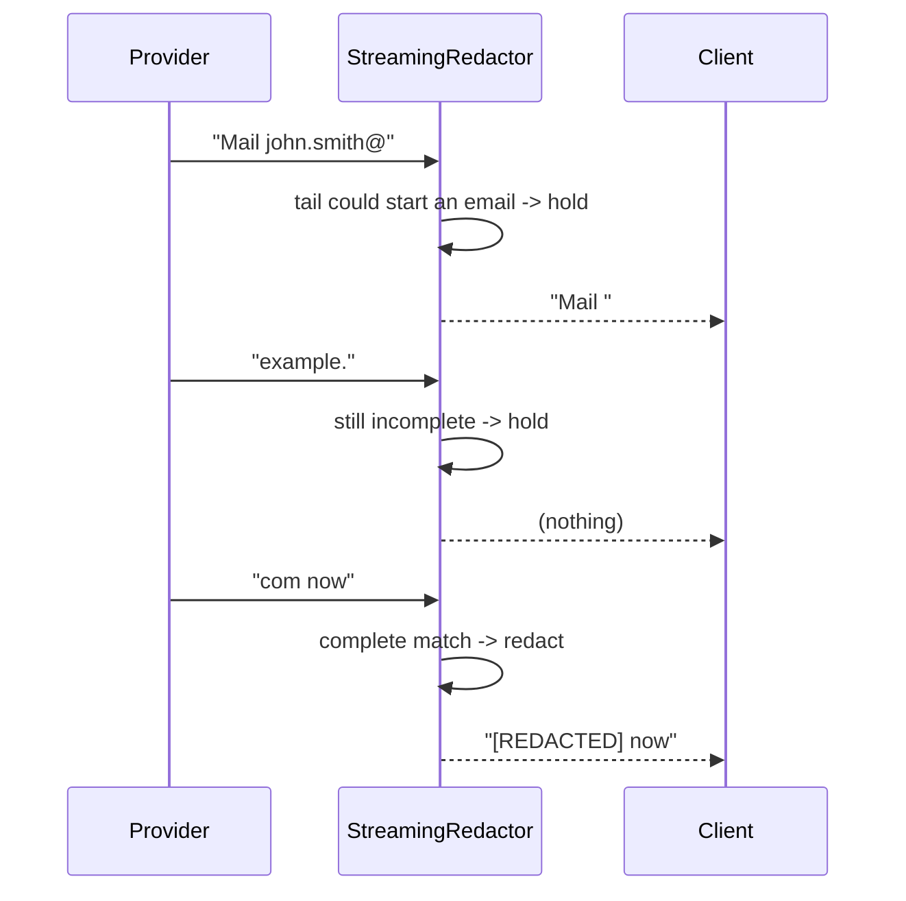
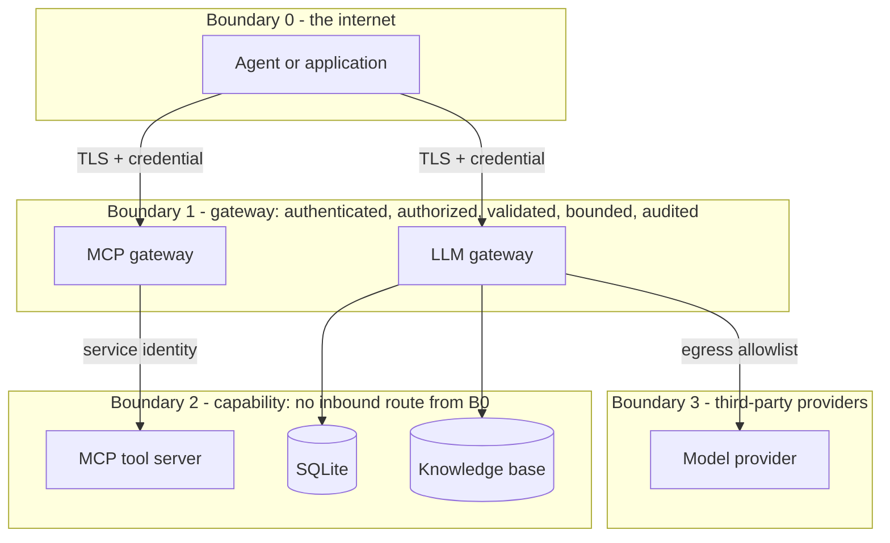

# FDE / AI Integration Engineer Assessment, Python

A working implementation of the four assessment tasks, an MCP server, an MCP
security gateway, a streaming LLM gateway with PII guardrails, and a
token-aware rate limiter with model fallback, built the way they would need to
be built to survive a customer environment, plus a labelled RAG production
enhancement.

**Python only.** No TypeScript, JavaScript, Node.js or npm anywhere in the repository.

| | |
|---|---|
| Language | Python 3.12+ (verified on 3.12 and 3.13) |
| MCP SDK | official `mcp` Python SDK (2.1.1) |
| Web | FastAPI + uvicorn |
| Storage | on-disk SQLite via `aiosqlite` (WAL) |
| Inference cost in CI | **$0**, deterministic mock provider, no API key, no GPU |
| Tests | 472 passing (unit 186 · security 86 · streaming 57 · rag 56 · integration 46 · e2e 35 · concurrency 6) |
| Lint / types / security | `ruff`, `mypy --strict`, `bandit`, `pip-audit`, all clean |

---

## Table of contents

1. [What this is](#what-this-is)
2. [Quick start](#quick-start)
3. [Assessment questions and how they were answered](#assessment-questions-and-how-they-were-answered)
4. [Architectural design](#architectural-design)
5. [Project directory structure](#project-directory-structure)
6. [Tech stack and why each piece](#tech-stack-and-why-each-piece)
7. [Best practices applied](#best-practices-applied)
8. [Running the services](#running-the-services)
9. [Documentation index](#documentation-index)
10. [Development](#development)
11. [Deliberate limitations](#deliberate-limitations)

---

## What this is

The assessment asks for four things. Each one has an obvious minimal answer and
a real answer; this repository implements the real answer and says why.

| Task | Minimal answer | What is here |
|---|---|---|
| **1, MCP server** | Two tools, some validation | Strict Pydantic schemas that reject type confusion and NaN/Infinity amounts, JSON-RPC error mapping, and STDIO isolation enforced three independent ways |
| **2, MCP gateway** | If the name starts with `admin_`, check the role | An allowlist method policy, an identity the request body cannot influence, and a test that asserts the downstream invocation count is **zero** on denial |
| **3, Streaming guardrail** | Regex each chunk | A bounded look-behind buffer that redacts PII split across chunk boundaries while adding no latency to ordinary prose, with Luhn validation so real identifiers survive |
| **4, Rate limit + fallback** | Sum tokens, compare | A sliding window in one `BEGIN IMMEDIATE` transaction (the read-check-write race is the whole difficulty), and failover restricted to actually retryable failures |

Plus, clearly labelled as beyond the brief: a **RAG pipeline** whose tenant
isolation is a SQL predicate rather than a prompt instruction.

---

## Quick start

```bash
python -m venv .venv
source .venv/bin/activate          # Windows: .venv\Scripts\activate
pip install -e ".[dev]"

pytest -q                          # 472 tests, no network, no API key
python scripts/smoke_test.py       # 15 end-to-end checks, prints evidence
```

With [uv](https://docs.astral.sh/uv/) (verified against a fresh clone):

```bash
uv sync --extra dev
uv run pytest -q
```

### See it work

```bash
python scripts/smoke_test.py
```

```
 1. [PASS] MCP server starts and completes the handshake over stdio
 6. [PASS] Viewer calling an admin_ tool is denied with -32001 and no downstream call
           error={'code': -32001, 'message': 'Unauthorized Tool Call'} downstream_calls_delta=0
 8. [PASS] Email split across stream chunks is redacted
           output: Your contact is [REDACTED], the identifier on file is [REDACTED], ...
11. [PASS] Token budget is enforced per tenant (429 once the window is spent)
13. [PASS] Primary exceeding the first-token deadline fails over to the secondary
15. [PASS] STDIO isolation: every stdout line is a JSON-RPC frame
```

---

## Assessment questions and how they were answered

Each task below states **what** was required, **why** it matters, **how** it was
implemented, **when** the mechanism runs, and **where** in the tree it lives.

---

### Task 1, Custom MCP server with strict validation and transport handling

> *"Write a runnable MCP server using the official SDK that exposes
> `get_customer_record` (customer_id formatted `CUST-XXXXX`) and
> `trigger_refund` (customer_id, positive float amount, reason with minimum
> length 10). Enforce strict input schema validation; reject invalid formats
> with standard MCP JSON-RPC error codes. Connect via stdio transport; ensure
> stdout is strictly reserved for JSON-RPC messages and debug logs write
> exclusively to stderr."*

| | |
|---|---|
| **What** | Two MCP tools over the stdio transport, using the official `mcp` Python SDK. |
| **Why** | Tools are how an agent *acts*. `trigger_refund` moves money, so its argument schema is a financial control, not a convenience. And stdout is the wire: one stray byte desynchronises the client's line framing, and the session appears to hang, silently and intermittently. |
| **How** | A transport-independent `ToolDispatcher` validates against Pydantic models and dispatches. `server.py` binds it to the SDK's **low-level** `Server`, which is what allows a handler to raise `MCPError` with an explicit JSON-RPC code (the high-level decorator API converts failures into `isError` results instead, see ADR-002). |
| **When** | An MCP client spawns `python -m fde_assessment.mcp_server`; one process per client session. |
| **Where** | `src/fde_assessment/mcp_server/` · tests in `tests/unit/test_mcp_schemas.py`, `tests/integration/test_mcp_stdio.py`, `tests/integration/test_stdio_isolation.py` |

**Validation decisions that go past the brief**

- `CUST-[0-9]{5}`, anchored and **ASCII-only**. Python's `\d` matches full-width
  Unicode digits, so `\d{5}` would accept an identifier that is a *different
  string* to every downstream system. Found by adversarial testing
  ([FINAL-REVIEW.md](FINAL-REVIEW.md) F-1).
- Amount must be a JSON **number**, not `"25.50"`, not `true` (`bool` is an
  `int` subclass), and must be finite. NaN and Infinity break every downstream
  comparison they touch.
- Reason needs ten **non-whitespace** characters; ten spaces satisfies a naive
  `min_length` and carries no audit value.
- `extra="forbid"` everywhere: an ignored unknown key is how a caller smuggles a
  field a future version might honour.

**STDIO isolation, three independent controls**

1. `common/logging.py` binds structlog *and* the stdlib root logger to stderr.
2. ruff's `T20` rule fails the build on any `print` under `src/`.
3. A subprocess test runs the real server at `LOG_LEVEL=DEBUG`, parses every
   stdout line as JSON-RPC, **and** includes a negative control proving the test
   would catch a deliberate leak.

**Error classification.** Validation and protocol failures become JSON-RPC
errors (`-32602`, `-32601`). Domain outcomes, "no such customer", "account
suspended", become successful tool results with `isError: true`. Reporting a
domain refusal as a protocol error would tell the client the call never
happened.

---

### Task 2, MCP security gateway proxy (tool filtering and auth)

> *"Build a lightweight HTTP/JSON-RPC reverse proxy acting as an MCP Gateway
> between an AI agent and a downstream mock MCP server. Read `Bearer <token>`
> and extract the user's role. If the method is `tools/list`, forward
> transparently. If `tools/call`, inspect `params.name`; if it starts with
> `admin_`, verify the token role is admin. If not authorized, intercept and
> return a JSON-RPC error `-32001: Unauthorized Tool Call` **without calling the
> downstream server**."*

| | |
|---|---|
| **What** | An authenticating, authorizing reverse proxy in front of MCP JSON-RPC. |
| **Why** | `tools/call` is remote code execution by design. A policy enforcement point is what makes an MCP server deployable in an enterprise where the agent, the tools and the data have different owners and different blast radii. |
| **How** | A intentionally linear pipeline, each stage failing closed: `bound body → authenticate → parse JSON-RPC → authorize → forward`. Policy lives in its own module so a security engineer can review it without reading proxy code. |
| **When** | Every agent points here; the MCP server is not routable from the agent network. |
| **Where** | `src/fde_assessment/mcp_gateway/` (`auth.py`, `policy.py`, `authorization.py`, `proxy.py`, `app.py`) · downstream mock in `mcp_server/http_mock.py` · tests in `tests/security/test_mcp_gateway_auth.py`, `tests/integration/test_mcp_gateway_proxy.py` |

**Three properties that are load-bearing**

- **Identity comes from the header, never the body.** `authorize()` reads
  `principal.role`, established by `authenticate()` from the bearer token;
  `params` is consulted only for the tool name. A viewer token whose payload
  claims `"role": "admin"` is still a viewer, asserted directly.
- **Fail closed on every ambiguity.** An unknown method, a missing
  `params.name`, or a `name` that is not a string are all denials. Methods are
  an **allowlist**, not a denylist.
- **Denial is provable, not merely plausible.** The tests assert
  `downstream.call_count == 0`, "we returned the right error" and "we did not
  perform the action" are two separate facts, and both are verified.

**Status-code contract** ([ADR-011](docs/decisions/ADR-011-status-code-contract.md)):
a failure that stopped a valid JSON-RPC exchange from starting carries an HTTP
status (401 / 413 / 400); everything after that is a JSON-RPC outcome at HTTP
200, including `-32001` and upstream failures. A JSON-RPC client is required to
parse the error object, and many HTTP clients discard the body on a 5xx.

---

### Task 3, LLM gateway streaming guardrail (PII redaction)

> *"Implement an LLM Gateway proxy endpoint that routes text generation
> requests to an LLM provider and streams the response back to the client.
> Intercept the returning chunk stream in real time; parse stream deltas to
> detect and redact sensitive patterns (emails, SSNs, credit card numbers),
> replacing them with `[REDACTED]`. Ensure the stream stays responsive without
> accumulating the full response in memory, minimising Time To First Token."*

| | |
|---|---|
| **What** | `POST /v1/chat/completions` streaming SSE, with PII redacted in flight. |
| **Why** | The gateway is the last place model output can be stopped before it reaches a client, a log, or a browser cache. The requirement contains a genuine tension: chunk-boundary correctness pulls toward buffering, TTFT pulls against it. |
| **How** | A **bounded look-behind buffer**. Redact matches that are certainly complete, then ask whether the *tail* could still become a match. `". The answer is "` cannot start an email, SSN or card, so it is emitted immediately; `john.smith@` can, so it is held. A hard cap makes memory O(window) per stream regardless of response length. |
| **When** | Wraps every provider stream, streaming and non-streaming alike, so there is one code path to test. |
| **Where** | `src/fde_assessment/llm_gateway/guardrails/` (`pii.py`, `streaming.py`) · tests in `tests/streaming/test_chunk_boundaries.py`, `tests/unit/test_pii.py` |

**Why not the two obvious designs**

| Design | Fails how |
|---|---|
| Redact each chunk independently | `john.smith@` / `example.` / `com` passes through unredacted, the brief's own example |
| Buffer the whole response, redact once | Correct, but TTFT becomes total generation time and memory grows with the answer, defeating both stated requirements |

**Precision matters too.** Card candidates are normalised, length-checked
(13-19 digits) and **Luhn-validated** before redaction, so a 16-digit order
reference survives while a real card does not.

**Verification.** Every fixed chunk size (1, 2, 3, 5, 7, 11, 17, 64), **every
possible two-way split** of every fixture, character-by-character streaming,
empty chunks, unicode, client disconnect, and an adversarial 200×50-character
unbroken token asserting the carry never exceeds the window.

**Measured cost:** ~3.4 µs per chunk, ~1.5 ms per 4 KB, far below the
inter-token interval of any real model
([BENCHMARKS.md](docs/testing/BENCHMARKS.md)).

---

### Task 4, Rate-limiting and model fallback router

> *"Write a resilient model-routing module for an LLM Gateway. Implement a
> token-aware sliding window rate limiter (e.g. maximum 50,000 tokens/minute per
> tenant API key). If the primary model endpoint returns 429 or times out after
> 3000 ms, automatically failover to a secondary backup provider. Ensure error
> responses return a standardized gateway error payload without leaking raw
> upstream stack traces or internal implementation details. Use on-disk
> sqlite."*

| | |
|---|---|
| **What** | A sliding-window token budget on on-disk SQLite, plus a primary/secondary router with a first-token deadline. |
| **Why** | Request counts do not describe LLM cost, one request can be 50 tokens or 50,000. And a gateway that forwards a vendor's bad day to every caller is not adding much. |
| **How** | The check and the insert run in **one `BEGIN IMMEDIATE` transaction** behind an `asyncio.Lock`; eviction of expired rows happens inside the same transaction. The router wraps the first `anext` in `asyncio.timeout` and then `aclose()`s the abandoned generator, so the upstream is really released. |
| **When** | Rate limit before any provider is contacted; routing on every completion. |
| **Where** | `src/fde_assessment/llm_gateway/rate_limit/limiter.py`, `routing/router.py`, `persistence/sqlite.py` · tests in `tests/unit/test_rate_limiter.py`, `tests/unit/test_model_router.py`, `tests/concurrency/` |

**The actual difficulty is the race.** Read the window sum, decide, insert, and
two concurrent requests both read 49,000, both conclude they fit, and both
insert. `tests/concurrency/` fires 100 concurrent 1,000-token requests at a
50,000 budget and asserts **exactly 50** are admitted, including across two
connections to the same file.

**Decisions the brief leaves open, made explicitly:**

| Question | Decision | Rationale |
|---|---|---|
| Is 50,000 allowed or rejected? | **Allowed**; 50,001 rejected | "Maximum" read inclusively. Both sides tested |
| Sliding or fixed window? | Sliding | A fixed window permits a 2× burst across the boundary |
| What does the 3000 ms measure? | **Time to first token** | A whole-stream deadline would truncate legitimate long answers |
| Failover on what? | 429, timeout, unavailable, malformed only | Retrying an invalid request wastes the secondary's quota and turns a deterministic 4xx into a slow 4xx |
| Failover mid-stream? | **No** | Bytes are already on the wire; a second provider would restart the answer mid-sentence |
| When are tokens charged? | Up front, then reconciled | A limiter that bills after generation cannot prevent the burst it exists to prevent |

**Error sanitisation.** Client-facing messages come from a fixed table keyed by
error code, never from `str(exc)`, leaking is structurally impossible rather
than merely avoided. The tests feed the proxy a stack trace, an internal IP, a
connection-refused errno and an HTML error page, and assert none of them appear
in the response.

---

### Task 5

**Not provided.** The brief's Overview says the assessment "consists of 5
practical technical tasks", but the document specifies four. No Task 5
requirements were invented. Evidence, the search performed, and the one
Overview theme no task body covers ("troubleshooting zero-trust network
deployments") are recorded in [TASK-5-MISSING.md](TASK-5-MISSING.md).

---

### Production enhancement, RAG

Beyond the brief, and labelled as such everywhere it appears.

| | |
|---|---|
| **What** | Ingestion, chunking, embeddings, a SQLite vector store, tenant-scoped retrieval, prompt assembly with citations, and an optional `search_knowledge_base` MCP tool. |
| **Why** | Enterprise knowledge is where the value is, and where the tenancy and prompt-injection risks are. |
| **How** | Filter in SQL (`WHERE tenant_id = ?`) **before** scoring, so another tenant's rows never enter the process. Retrieved passages sit in a labelled `<retrieved_context>` region the system prompt declares untrusted, with delimiter lookalikes neutralised. |
| **When** | Opt-in per request (`"rag": {"enabled": true}`), or via the MCP tool when a corpus is configured. |
| **Where** | `src/fde_assessment/rag/` · `corpus/` · tests in `tests/rag/`, `tests/security/test_rag_isolation.py` |

Tenant isolation is a SQL predicate, **not** a model instruction. A model
instruction is a suggestion; `WHERE tenant_id = ?` is not.

---

## Architectural design

### System view



The capability plane is not routable from the untrusted plane. In
`docker-compose.yml` this is an `internal: true` network: the tool server has no
route off it, so the gateway is the only path in.

### Request pipelines

```mermaid
flowchart TD
    subgraph MCPpath[MCP path]
        A0[POST /rpc] --> A1[Bound body]
        A1 --> A2[Authenticate]
        A2 --> A3[Parse JSON-RPC]
        A3 --> A4{Method policy}
        A4 -->|forward| A6[Downstream MCP server]
        A4 -->|inspect| A5{admin_ tool and<br/>role sufficient?}
        A4 -->|reject| AX[-32601]
        A5 -->|yes| A6
        A5 -->|no| AY[-32001<br/>downstream never called]
    end

    subgraph LLMpath[LLM path]
        B0[POST /v1/chat/completions] --> B1[Authenticate tenant]
        B1 --> B2[Validate request]
        B2 --> B3[Estimate tokens]
        B3 --> B4{Rate limit}
        B4 -->|over budget| BX[429 + Retry-After]
        B4 -->|fits| B5[Optional retrieval]
        B5 --> B6{Route}
        B6 -->|healthy| B7[Primary]
        B6 -.429 or 3s.-> B8[Secondary]
        B7 --> B9[Streaming PII guardrail]
        B8 --> B9
        B9 --> B10[SSE to client]
        B10 --> B11[Reconcile token accounting]
    end
```



Order is load-bearing in both. Authentication precedes parsing, so an anonymous
caller cannot exercise the parser. Rate limiting precedes routing, so a tenant
over budget never costs a provider call.

### Chunk-boundary redaction



### Zero-trust boundaries



Every request crossing Boundary 1 is authenticated, authorized, validated,
bounded and audited, the five properties, each with a named mechanism, in
[ARCHITECTURE.md](ARCHITECTURE.md).

Full diagrams, including the unauthorized-tool and fallback sequences, are in
[ARCHITECTURE.md](ARCHITECTURE.md); per-component WHAT/WHY/HOW/WHEN in
[docs/architecture/COMPONENTS.md](docs/architecture/COMPONENTS.md).

---

## Project directory structure

```
fde-ai-integration-assessment/
│
├── README.md                       ← you are here
├── ARCHITECTURE.md                 components, diagrams, request flows, trust boundaries
├── SECURITY.md                     controls implemented, and what is explicitly NOT claimed
├── THREAT-MODEL.md                 STRIDE: MCP, LLM, gateway, RAG, infrastructure
├── COST-OPTIMIZATION.md            why CI costs $0; production levers ranked by impact
├── OPERATIONS.md                   config, metrics, alerts, failure modes, deploy checklist
├── FDE-DELIVERY.md                 discovery, integration, rollout, customer verticals
├── FINAL-REVIEW.md                 self-review: scores + 17 findings with status
├── TASK-5-MISSING.md               evidence that the brief contains Tasks 1-4 only
├── CONTRIBUTING.md                 standards, testing policy, ADR process
├── LICENSE                         MIT
│
├── pyproject.toml                  deps, ruff, mypy (strict), pytest, bandit config
├── uv.lock                         reproducible resolution
├── .env.example                    generated from Settings; parity asserted in tests
├── Dockerfile                      multi-stage, non-root UID 10001, read-only rootfs
├── docker-compose.yml              full demo path; tool server on an internal-only network
├── .dockerignore  .gitignore  .gitattributes  .gitleaks.toml
│
├── .github/workflows/
│   ├── ci.yml                      ruff · mypy · pytest · smoke · wheel · Docker (3.12 + 3.13)
│   └── security.yml                bandit · pip-audit · gitleaks · security suite (+ weekly)
│
├── src/fde_assessment/
│   ├── common/                     cross-cutting: the vocabulary both gateways share
│   │   ├── config.py               validated Settings; refuses dev creds in production
│   │   ├── errors.py               error taxonomy; safe messages from a fixed table
│   │   ├── logging.py              structlog pinned to stderr + redaction processor
│   │   ├── models.py               shared request/identity models; HMAC fingerprints
│   │   └── jsonrpc.py              strict JSON-RPC envelope parsing
│   │
│   ├── mcp_server/                 ── TASK 1 ──
│   │   ├── server.py               official SDK, stdio transport, JSON-RPC error mapping
│   │   ├── registry.py             transport-independent dispatch (no SDK imports)
│   │   ├── schemas.py              strict Pydantic tool schemas
│   │   ├── http_mock.py            mock downstream MCP server (Task 2's proxy target)
│   │   └── tools/                  customer.py · refund.py
│   │
│   ├── mcp_gateway/                ── TASK 2 ──
│   │   ├── app.py                  FastAPI pipeline + status-code contract
│   │   ├── auth.py                 Bearer → principal (constant-time, full-table scan)
│   │   ├── policy.py               method allowlist + admin_ rule
│   │   ├── authorization.py        the decision, as a pure function
│   │   └── proxy.py                bounded downstream forwarding + failure normalisation
│   │
│   ├── llm_gateway/                ── TASKS 3 + 4 ──
│   │   ├── app.py                  /v1/chat/completions, SSE, reconciliation
│   │   ├── auth.py                 API key → tenant
│   │   ├── guardrails/             pii.py (patterns + Luhn) · streaming.py (carry buffer)
│   │   ├── rate_limit/limiter.py   sliding window, one atomic transaction
│   │   ├── routing/router.py       first-token deadline, retryable-only failover
│   │   └── providers/              base.py · mock.py · ollama.py
│   │
│   ├── rag/                        ── PRODUCTION ENHANCEMENT ──
│   │   ├── chunking.py  embeddings.py  ingestion.py  vector_store.py
│   │   ├── retriever.py            tenant scope enforced in SQL
│   │   ├── pipeline.py             untrusted-context prompt assembly + citations
│   │   └── service.py  models.py
│   │
│   ├── persistence/sqlite.py       WAL, busy_timeout, BEGIN IMMEDIATE
│   └── observability/metrics.py    counters + histograms, Prometheus rendering
│
├── tests/                          472 tests, offline and deterministic
│   ├── unit/          186  validation · policy · PII · limiter · routing · config
│   ├── security/       86  auth · authorization · isolation · leakage · adversarial
│   ├── streaming/      57  every two-way split of every fixture
│   ├── rag/            56  chunking · ingestion · retrieval quality · MCP tool
│   ├── integration/    46  real subprocesses and ASGI apps
│   ├── e2e/            35  client → gateway → provider → guardrail → client
│   └── concurrency/     6  the rate limiter under contention
│
├── scripts/
│   ├── smoke_test.py               15 end-to-end checks with printed evidence
│   ├── benchmark.py                measured performance; never estimated
│   ├── seed_db.py                  schema + corpus ingestion (idempotent)
│   └── gen_env_example.py          generates .env.example from Settings
│
├── docs/
│   ├── architecture/COMPONENTS.md  WHAT/WHY/HOW/WHEN/SECURITY/COST/SCALE per component
│   ├── decisions/                  ADR-001 … ADR-012 + index
│   ├── security/LOGGING-POLICY.md  what may and may not be logged
│   ├── testing/TEST-MATRIX.md      requirement → test → expected result
│   ├── testing/BENCHMARKS.md       measured performance, with the machine it came from
│   └── operations/RUNBOOK.md       ten incident procedures keyed by symptom
│
└── corpus/                         sample knowledge base for the RAG enhancement
```

Every module opens with a **WHAT / WHY / HOW / WHEN** block, and the
security-relevant ones add **SECURITY / COST / SCALE**. The reasoning lives next
to the code, not only in the docs.

---

## Tech stack and why each piece

| Layer | Choice | Why this, not the alternative |
|---|---|---|
| Language | **Python 3.12+** | One toolchain end to end; `asyncio.timeout` (3.11+) is what makes the router's cancellation correct rather than approximate. TypeScript rejected: the risk concentrates in validation, where Pydantic is stronger ([ADR-001](docs/decisions/ADR-001-python.md)) |
| MCP | **`mcp` 2.1.1, low-level `Server`** | The high-level decorator API converts handler failures into `isError` results; only the low-level API produces real JSON-RPC error codes, the scored requirement ([ADR-002](docs/decisions/ADR-002-official-mcp-sdk.md)) |
| Web | **FastAPI + uvicorn** | Lifespan management, dependency wiring, and a `TestClient` that runs the real ASGI app. Bodies are read manually to enforce a size cap before parsing ([ADR-003](docs/decisions/ADR-003-fastapi.md)) |
| Validation | **Pydantic v2** | Declarative, therefore reviewable: a security reviewer reads a model, not a chain of `if`s. `extra="forbid"` at every entry point |
| Config | **pydantic-settings** | One validated object at startup; a bad value is a crash before the first request. `.env.example` is generated from it and parity is asserted in tests |
| HTTP client | **httpx** | Async streaming, `MockTransport` and `ASGITransport`, which is what lets the tests assert the downstream call count through the real client code path |
| Storage | **SQLite (`aiosqlite`) + WAL** | Mandated by Task 4, and genuinely right at this scale, *if* its concurrency model is respected: WAL, `busy_timeout`, `BEGIN IMMEDIATE` ([ADR-004](docs/decisions/ADR-004-sqlite.md)) |
| Logging | **structlog → stderr** | Structured, and the sink binding *is* the STDIO isolation guarantee |
| Providers | **Mock (default) + Ollama (optional)** | $0 deterministic CI, and failure modes, 429, first-token stall, malformed response, that no vendor produces on cue ([ADR-008](docs/decisions/ADR-008-mock-provider.md)) |
| Embeddings | **Hashed local (default) + Ollama** | Free, deterministic, offline. Lexical rather than semantic, and the measured recall says so |
| Vector search | **SQLite blobs + Python cosine** | Filter in SQL, score in Python. No NumPy, no vector database, linear over thousands of chunks beats operating one ([ADR-012](docs/decisions/ADR-012-vector-store.md)) |
| Lint / format | **ruff** | One tool for lint, imports, formatting, and the bandit-family `S` and `ASYNC` rules |
| Types | **mypy --strict** | Clean across 51 source files |
| Security | **bandit · pip-audit · gitleaks** | Static analysis, dependency CVEs, secret scanning, per change and weekly |
| Tests | **pytest + pytest-asyncio** | `asyncio_mode = "auto"`; without it async tests silently skip and the suite reports green while testing nothing |
| Container | **python:3.12-slim, multi-stage** | No build toolchain in the runtime layer; non-root; read-only root filesystem |
| CI | **GitHub Actions** | Two workflows, quality and security. No paid API, no external model, no GPU, no key |

---

## Best practices applied

**Security**

- Fail closed on every ambiguity, unknown method, unreadable tool name,
  insufficient role.
- Identity from the credential, never from the request body.
- Least privilege: `admin_` tools gated; the model's tool access is decided by
  the caller's role, so even a successful prompt injection cannot escalate.
- Defence in depth: the schema caps `top_k`, and the pipeline caps it again
  against configuration.
- Secrets never logged; credentials stored only as HMAC fingerprints with a
  configured pepper.
- Secure defaults: loopback binding, `extra="forbid"`, no redirect following,
  and production refuses published development credentials.
- Data minimisation: logs carry identifiers and shapes, never payloads.

**Engineering**

- Transport separated from logic, so the validation matrix is testable in
  microseconds and the SDK is replaceable.
- Dependency injection everywhere that matters, providers, limiter, database
  and RAG service are constructor arguments, so tests drive real failure modes
  without monkeypatching.
- No blocking I/O on a request path; ruff's `ASYNC` rules enforce it.
- No global mutable state on request paths.
- Errors leave through exactly one function per surface.
- Strict typing (`mypy --strict`), no `Any` leakage.

**Testing**

- Assert absences as well as presences: "returned `-32001`" and "downstream call
  count is zero" are separate facts.
- Exhaustive where exhaustiveness is cheap: every two-way split of every
  streaming fixture.
- Negative controls: a test proving the stdout-purity test would catch a real
  leak.
- An adversarial suite that attacks the finished system, and found a real bug.
- Deterministic and offline: no network, no key, no GPU, no flakes.

**Operations**

- Structured logs with correlation ids, sanitised against log injection.
- One audit event per security decision, recording whether the downstream was
  invoked.
- Metrics that answer the four LLMOps questions: traffic, failures, latency,
  cost.
- Runbooks keyed by symptom, not by component.
- A deployment checklist that names what the code *cannot* enforce.

**Documentation**

- WHAT / WHY / HOW / WHEN in every module, next to the code it describes.
- 12 ADRs with the alternatives considered and the trigger to revisit.
- Limitations in the README, not buried in a footnote.
- Every number measured; every cited test name and link verified to resolve.

---

## Running the services

### Task 1, MCP server (stdio)

```bash
python -m fde_assessment.mcp_server
```

Drive it by hand:

```bash
printf '%s\n' \
  '{"jsonrpc":"2.0","id":1,"method":"initialize","params":{"protocolVersion":"2025-06-18","capabilities":{},"clientInfo":{"name":"cli","version":"1"}}}' \
  '{"jsonrpc":"2.0","method":"notifications/initialized"}' \
  '{"jsonrpc":"2.0","id":2,"method":"tools/call","params":{"name":"get_customer_record","arguments":{"customer_id":"CUST-12345"}}}' \
  | python -m fde_assessment.mcp_server
```

As an MCP client would launch it:

```json
{
  "mcpServers": {
    "fde-assessment": {
      "command": "python",
      "args": ["-m", "fde_assessment.mcp_server"]
    }
  }
}
```

### Tasks 2, 3, 4, the gateways

```bash
cp .env.example .env

python -m fde_assessment.mcp_gateway     # :8000
python -m fde_assessment.llm_gateway     # :8001
```

Or the whole path at once:

```bash
docker compose up --build
```

A viewer denied an admin tool:

```bash
curl -s localhost:8000/rpc \
  -H 'authorization: Bearer dev-viewer-token' \
  -d '{"jsonrpc":"2.0","id":1,"method":"tools/call","params":{"name":"admin_reset_key","arguments":{}}}'
# {"jsonrpc":"2.0","id":1,"error":{"code":-32001,"message":"Unauthorized Tool Call"}}
```

A stream with PII redacted in flight:

```bash
curl -N -s localhost:8001/v1/chat/completions \
  -H 'authorization: Bearer dev-tenant-a-key' \
  -d '{"model":"mock-primary","messages":[{"role":"user","content":"summarise"}],"stream":true}'
# ... "content":"Here is the summary you asked for. The account contact is [REDACTED], ..."
```

> The tokens above are published development values. `Settings` **refuses to
> start** with `APP_ENV=production` while any of them is still configured.

---

## Documentation index

| Document | What it answers |
|---|---|
| [ARCHITECTURE.md](ARCHITECTURE.md) | Components, diagrams, request flows, trust boundaries |
| [SECURITY.md](SECURITY.md) | Controls implemented, and what is explicitly *not* claimed |
| [THREAT-MODEL.md](THREAT-MODEL.md) | STRIDE across MCP, LLM, gateway, RAG, infrastructure |
| [COST-OPTIMIZATION.md](COST-OPTIMIZATION.md) | Why CI costs $0, and the levers that matter in production |
| [OPERATIONS.md](OPERATIONS.md) | Running it: config, metrics, alerts, runbooks, failure modes |
| [FDE-DELIVERY.md](FDE-DELIVERY.md) | Discovery questions, integration, rollout, customer verticals |
| [FINAL-REVIEW.md](FINAL-REVIEW.md) | Self-review: scores, all 17 findings, and what is still open |
| [TASK-5-MISSING.md](TASK-5-MISSING.md) | The supplied brief contains Tasks 1-4; no Task 5 was provided |
| [docs/decisions/](docs/decisions/) | 12 ADRs: context, decision, alternatives, consequences |
| [docs/architecture/COMPONENTS.md](docs/architecture/COMPONENTS.md) | Per-component WHAT/WHY/HOW/WHEN/SECURITY/COST/SCALE |
| [docs/testing/TEST-MATRIX.md](docs/testing/TEST-MATRIX.md) | Requirement → test → expected result |
| [docs/testing/BENCHMARKS.md](docs/testing/BENCHMARKS.md) | Measured performance, with the machine it came from |
| [docs/security/LOGGING-POLICY.md](docs/security/LOGGING-POLICY.md) | What may and may not be logged |
| [docs/operations/RUNBOOK.md](docs/operations/RUNBOOK.md) | Incident procedures keyed by symptom |
| [CONTRIBUTING.md](CONTRIBUTING.md) | Standards, testing policy, ADR process |

---

## Development

```bash
pytest -q                       # full suite
pytest tests/security -q        # authentication, authorization, isolation, leakage
pytest tests/concurrency -q     # the rate limiter under contention

ruff check .                    # lint
ruff format --check .           # formatting
mypy src                        # strict type checking
bandit -r src -c pyproject.toml # static security analysis
pip-audit                       # dependency CVEs

python -m build                 # wheel + sdist
python scripts/benchmark.py     # measured performance
python scripts/seed_db.py       # schema + sample corpus
docker compose up --build       # the whole path
```

### Optional: a real local model

Nothing in CI needs one. For local work with real tokenisation and real chunk
boundaries:

```bash
ollama pull qwen2.5:3b
ollama pull nomic-embed-text

PRIMARY_PROVIDER=ollama PRIMARY_MODEL=qwen2.5:3b RAG_EMBEDDING_PROVIDER=ollama \
  python -m fde_assessment.llm_gateway
```

Ollama is never required: tests that would use it are marked
`@pytest.mark.ollama` and are not part of the default run.

---

## Deliberate limitations

Stated here rather than discovered later. Details in
[SECURITY.md](SECURITY.md), [FINAL-REVIEW.md](FINAL-REVIEW.md) and the ADRs.

- **Authentication is a configuration-driven mock.** Production needs OIDC/JWT
  validation against the customer's identity provider. The seam is one function;
  nothing downstream consumes a token.
- **No token revocation, rotation or replay protection.** A leaked credential is
  valid until configuration changes.
- **PII detection covers three patterns.** Emails, US SSNs and Luhn-valid card
  numbers. Names, addresses, phone numbers and free-text detail are not
  detected, and obfuscation defeats regex entirely, the adversarial suite
  *asserts* this rather than hiding it.
- **Rate limiting is per node.** SQLite cannot coordinate replicas; two gateway
  pods each admit up to the limit. Redis is the documented evolution (ADR-006).
- **No circuit breaker, no idle timeout mid-stream.** Both named in ADR-010.
- **Retrieval quality with the mock embedder is lexical, not semantic.**
  Measured Recall@1 = 0.63, Recall@3 = 1.00, MRR@5 = 0.79 on the eight-question
  set, real numbers, printed by `scripts/benchmark.py`.
- **The Docker image is built and health-checked in CI, not on the authoring
  machine** (no daemon there). CI asserts it runs as a non-root uid and that
  `/healthz` returns 200.
- **Not deployed anywhere.** Everything here was tested locally and in CI. No
  production deployment, no compliance certification, no availability claim.

---

## Licence

MIT, see [LICENSE](LICENSE).
